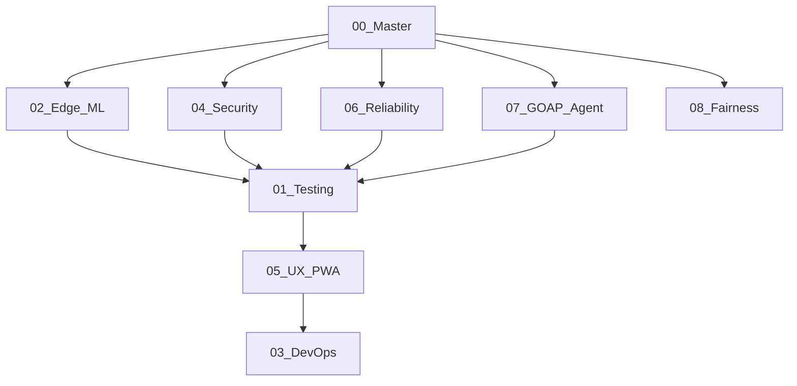

# GOAP Orchestrator: Master Development Plan

**Status:** RELEASE CANDIDATE (RC-1)
**Objective:** Harden Dermatology AI Orchestrator for Production Deployment.
**Orchestrator:** `goap-agent` (System Orchestrator)

**Orchestrator Plan:** See `07_goap_agent_orchestration.md` for runtime responsibilities, tracing, and testing.

## 1. World State Analysis

- **Current State:** Feature Complete. Observability, Accessibility, Testing coverage met. CSP and security headers implemented. Code refactoring completed.
- **Goal State:** `[Released, Audited]`

## 2. Agent Handoff Coordination

| Agent ID                | Role              | Assigned Plan                     | Status                                                                                                          |
| :---------------------- | :---------------- | :-------------------------------- | :-------------------------------------------------------------------------------------------------------------- |
| `QA-Specialist`         | Test Engineering  | `01_testing_strategy.md`          | **COMPLETED** - Full Suite.                                                                                     |
| `ML-Edge-Engineer`      | AI Implementation | `02_edge_ml_implementation.md`    | **COMPLETED** - Memory Safe.                                                                                    |
| `DevOps-Lead`           | Infrastructure    | `03_devops_workflow.md`           | **COMPLETED** - Configured.                                                                                     |
| `Sec-Ops`               | Security          | `04_security_audit.md`            | **COMPLETED** - Encrypted.                                                                                      |
| `UX-A11y-Lead`          | Frontend/PWA      | `05_ux_pwa_strategy.md`           | **COMPLETED** - A11y Focus Mgmt.                                                                                |
| `Reliability-Architect` | Observability     | `06_reliability_observability.md` | **COMPLETED** - Vitals Active.                                                                                  |
| `GOAP-Agent`            | Orchestrator      | `07_goap_agent_orchestration.md`  | **COMPLETED** - Full implementation with A\* planner, execution trace collection, and comprehensive test suite. |

## 3. Dependency Graph (DAG)

## 4. Execution Priorities (Phase 3: Maintenance)

1.  **Monitor Vitals:** Review `Logger` output for real-world performance data.
2.  **Model Updates:** Periodically update `SmolLM2` weights in `services/agentDB.ts`.
3.  **Dependency Audits:** Regular `npm audit` checks.

---

_Signed: GOAP Orchestrator v1.4 (RC-1)_
